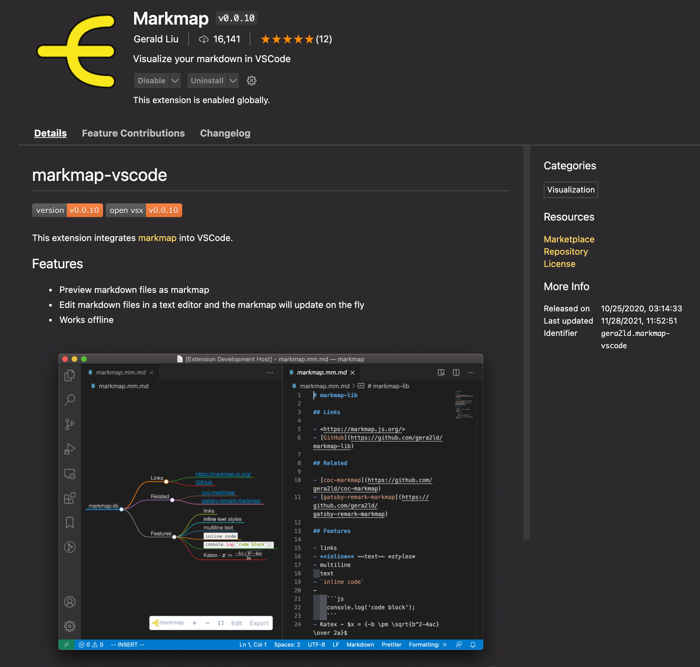

# Lightsaber

Mind Maps of Star Wars


## Introduction 

Using The Star Wars API, Lightsaber collects JSON data and then uses Jinja2 templates to create markdown files. Using the markmap VS Code extension these markdown files render as mind maps! 

## Setup

I recommend running Lightsaber in a Python virtual environment. This will help keep your host system clean and allow you to have multiple environments to try new things. If you are not using a virtual environment, start at the download/clone step below.

You will also need Python 3 and venv installed on your host system.

In your project directory, create your virtual environment
``` console
python3 -m venv env
```
Activate (use) your new virtual environment (Linux):
``` console
source env/bin/activate
```
Download or clone the mind_nmap repository:

``` console
git clone https://github.com/automateyournetwork/lightsaber.git
```

## Run the code! 

```console
cd Lightsaber
cd MindMaps
python3 Lightsaber.py
```

## View the Mindmaps 

Install the markmap VS Code Extension



Open the markdown file and click the "Open as markmap"